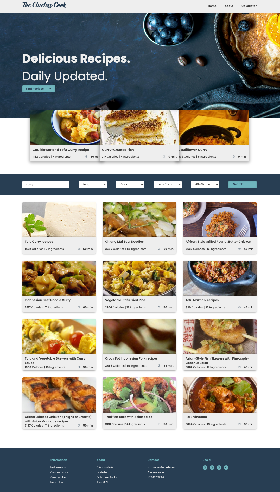

Table of Content
------------------------------------------------------------------------------------------------------------------------
1. Introduction
2. Features
3. Installation
------------------------------------------------------------------------------------------------------------------------

1. Introduction
---------------
Do you enjoy good food but are you not always sure what to cook? Just looking for inspiration? Or do you like to pay attention to what nutrients are in your meal?

Don't look further because this application is made for you!

2. Features
-----------
The application is build up out of the following features:

Navigation:
Every page has a navigation-bar where you can easily navigate between the different pages and functions. 
Clicking on the logo "The Clueless Cook" and on "Home" will bring you back to the homepage.
Clicking "About" brings you to the footer with the about-information of this website.
Clicking "Calculator" will bring you to the "Calorie Calculator" page.

Homepage:
The header of the homepage always features some random recipes as a suggestion. You can directly go to the recipe by clicking on it.

The main of the homepage you can search for recipes by typing your desired ingredient in the "Recipe search" field. You can put in multiple ingredients using a "," to distinguish the separate ingredients.
You can just search by ingredient name, but you can also use the following option to narrow your search down:
* Meal Type: this will let you choose what type of meal you would like to find, ie. Breakfast, Lunch, Dinner, etc..
* Cuisine: this will let you choose what type of cuisine you would like to find, ie. American, Asian, British, etc..
* Diet: this will let you choose what type of diet-requirements you would like to find, ie. Balanced, High-Fiber, High-Protein, etc..
* Time: this indicates how much time it will take to prepare the recipe you choose, ie. 0-15 min, 15-30 min, 30-60 min, etc..

Once you've searched for recipes you can select one in the results list and click on it. This will open a new tab with the choosen recipe. 
By opening a new tab you can have multiple recipes open at the same time if you'd like to read first how to prepare or what ingredients are in it and decide which recipe to make after. This way your search results will remain on the homepage.

Recipe-page:
The recipe-page features all the information needed to prepare the recipe.
It also shows you the nutrients of the recipe and the health labels associated with the recipe.

Calorie Calculator-page:
The Calorie Calculator lets you find products and their calories, fat, and carbohydrates content. You can add different products together that add up and give you the total of calories, fat and carbohydrates.

Homepage preview:

3. Installation
---------------

Step 1 - Installing Node.js and npm.

In the terminal type the following command to find out what version is being used:

node -v     then press enter.

npm -v      then press enter.

Step 2 - Installing dependencies & development dependencies.
These development dependencies will show up in your package.json file as soon as you install them. 

In the terminal type the following commands:

npm init    then press enter and follow the instructions in the terminal or keep pressing enter till you get at new command line.

npm install parcel --save-dev   then press enter

These dependencies will show up in your package.json and package-lock.json files as soon as you install them.
You can check if the following is added to the package.json file, otherwise add this yourself into the file:

"scripts": {
"start": "parcel src/index.html",
"build": "parcel build src/index.html",
"test": "echo \"Error: no test specified\" && exit 1"
}

The development dependencies used for this application are:

buffer: v6.0.3
parcel: v2.6.1
process: v0.11.10

To install the dependencies put in the following command in the terminal:

npm install axios   then press enter

The dependencies used for this application are:

axios: v0.27.2

Step 3 - API
This product uses the API from Edamam.com. There's multiple options but this applications uses the following API's from Edamam:
* Recipe Search API (version V2)
* Food Database API (version V2)

To start using the application you will have to sign-up for an account on the Edamam website. 
To do this visit www.edamam.com and go to "Signup API" in the top right corner. Select the APIs mentioned above and copy and paste your 'app_key' and 'app_id' in the following files:

* fetchDataHomeHeader.js
* fetchDataHomeSearch.js
* fetchDataRecipePage.js
* fetchDataCalculatorPage.js

(You will find my app_key and app_id in the enclosed PDF file.)

Step 4 - Run the application
Run the application by typing the following command in the terminal:

npm run start

You are now ready to use the application. Enjoy!

